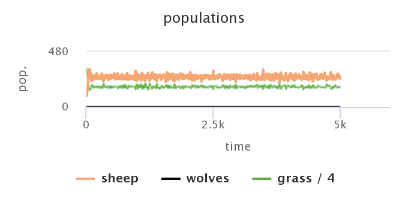
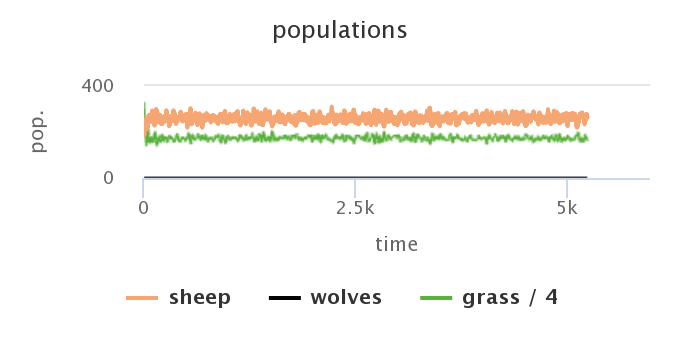
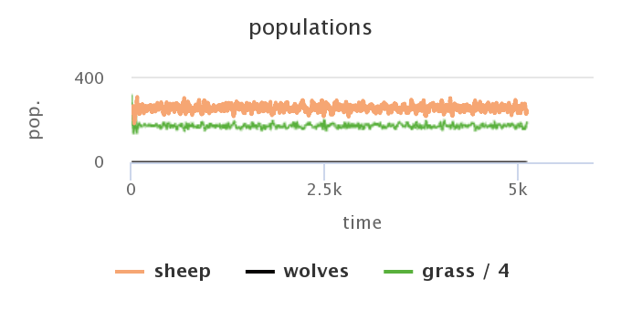

## Комп'ютерні системи імітаційного моделювання
## СПм-22-3, **Риндик Ігор Вікторович**
### Лабораторна робота №**1**. Опис імітаційних моделей та проведення обчислювальних експериментів

 

### Вибрана модель у середовищі NetLogo:
[Wolf Sheep Predation](http://www.netlogoweb.org/launch#http://www.netlogoweb.org/assets/modelslib/Sample%20Models/Biology/Wolf%20Sheep%20Predation.nlogo)

 

### Вербальний опис моделі:
Дослідження стабільності екосистем хижак-жертва. Таку систему називають нестабільною, якщо вона схильна до вимирання одного чи декількох видів, що беруть участь. Натомість, систему вважають стабільною, якщо вона має тенденцію підтримуватися з часом, незважаючи на коливання розмірів популяцій.

Існують дві основні варіації цієї моделі:
- у першій варіації, версії "вівці-вовки", вовки та вівці випадково блукають по ландшафту, при цьому вовки шукають вівцей для полювання. Кожен крок коштує вовкам енергію, і вони повинні їсти вівців, щоб поповнити свою енергію - коли у них закінчується енергія, вони помирають. Щоб дозволити популяціям продовжувати існування, у кожного вовка або вівці є фіксована ймовірність розмноження на кожному кроці часу. У цьому варіанті ми моделюємо траву як «нескінченну», щоб вівці завжди мали достатньо їжі, і ми явно не моделюємо поїдання або вирощування трави. Таким чином, вівці не отримують і не втрачають енергію під час їжі чи руху.
- Другий варіант, версія «вівці-вовки-трава», явно моделює траву (зелену) на додаток до вовків і овець. Поведінка вовків ідентична першому варіанту, але цього разу вівці повинні їсти траву, щоб зберегти свою енергію - коли вони закінчуються, вони гинуть. Після того, як траву з’їли, вона відростає лише через певний проміжок часу.

### Керуючі параметри:
- **model-version** визначає моделюємо ми овець, вовків і траву, чи просто овець і вовків.
- **initial-number-sheep** визначає початковий розмір популяції овець.
- **initial-number-wolves** визначає початковий розмір популяції вовків.
- **grass-regrowth-time** визначає cкільки часу потрібно, щоб трава відростала після того, як її з’їли (не використовується у версії моделі вівці-вовки).
- **sheep-gain-from-food** визначає кількість енергії, яку овець отримує за кожну з’їдену травинку (не використовується у версії моделі вівці-вовки).
- **wolf-gain-from-food** визначає кількість енергії, яку отримують вовки за кожну з’їдену вівцю.
- **sheep-reproduce** визначає імовірність розмноження вівці на кожному кроці часу.
- **wolf-reproduce** визначає імовірність розмноження вовка на кожному кроці часу.
- **show-energy** визначає показувати чи ні енергію кожної тварини числом.

### Внутрішні параметри:
- **max-sheep**. Максимальне значення розміру популяції овець. 
- **sheep**. Набір овець у певний проміжок часу.
- **wolves**. Набір вовків у певний проміжок часу.
- **energy**. Кількість енергії у контретного вовка чи вівці.
- **countdown**. Відлік часу для пророщеня трави.

### Критерії ефективності системи:
- Розмір популяцій овець та вовків та кількість трави на кожному проміжку часу(не використовеється у версії моделі вівці-вовки).
- Стабільність популяції хижаків і здобичі: одна з головних цілей моделі полягає в спостереженні стабільних популяцій хижаків і здобичі протягом тривалого часу. Пошук рівноважниї або циклічниї закономірності в динаміці популяції, щоб оцінити, чи модель точно відображає відносини хижак-жертва.
- Стабільність і рівновага: модель повинна демонструвати стабільність з часом. Це означає, що коливання чисельності популяцій хижаків і здобичі зрештою мають стати відносно стабільними. Рівновага між популяціями вовків і овець є ключовим показником правильної моделі.

### Примітки:
Одна одиниця енергії віднімається за кожен крок, який робить вовк - під час запуску версії моделі вівці-вовки-трава, одна одиниця енергії віднімається за кожен крок, який робить вівця.

### Недоліки моделі:
У базовій версії моделі правила пересування і поведінки вовків і овець фіксовані і не адаптуються до мінливих умов. Насправді тварини можуть коригувати свою поведінку у відповідь на зміни середовища або доступність ресурсів.

Припущення та правила моделі дуже абстрактні. Наприклад, вона не враховує такі фактори, як індивідуальні варіації в межах виду, вікові структури, генетичне різноманіття або гетерогенність середовища. Ці спрощення можуть обмежити реалістичність моделі.
 

## Обчислювальні експерименти

### 1. Аналіз залежності показника імовірності розмноження на динаміку популяцій.
Досліджується чутливість моделі до змін у темпах відтворення вовків і овець, зосереджуючись на тому, як невеликі зміни в цих показниках впливають на динаміку популяції. Порівнюються розміри популяції наприкінці кожного експерименту з базовим сценарієм.
Визначається, як зміни темпів розмноження впливають на ріст популяції, рівновагу та загальну динаміку хижак-жертва.
Аналізується, чи призводять невеликі зміни в темпах відтворення до значних відмінностей у поведінці моделі.

Проводиться почергове змінення параметрів **sheep-reproduce** та **wolf-reproduce** на маленький крок (+-0.01) в більшу та меньшу сторону, починаючи с базових показників. Експерименти проводяться з однаковим значенням часу. Інші параметри мають значення за замовчуванням.

<table>
<thead>
<tr><th>Імовірність розмноження вівці</th><th>Імовірність розмноження вовка</th><th>Кількість овець</th><th>Кількість вовків</th></tr>
</thead>
<tbody>
<tr><td>0.04</td><td>0.05</td><td>171</td><td>62</td></tr>
<tr><td>0.05</td><td>0.05</td><td>156</td><td>85</td></tr>
<tr><td>0.03</td><td>0.05</td><td>180</td><td>49</td></tr>
<tr><td>0.04</td><td>0.06</td><td>156</td><td>37</td></tr>
<tr><td>0.04</td><td>0.04</td><td>123</td><td>70</td></tr>
</tbody>
</table>

Ймовірність відтворення вівці, як видається, має більш істотний вплив на динаміку популяції, ніж імовірність відтворення вовка в цих експериментах. Вищі показники відтворення овець мають тенденцію до зменшення поголів’я овець і збільшення популяції вовків. Вищі темпи розмноження вовків мають тенденцію до зменшення популяції як овець, так і вовків, можливо, через те, що популяція вовків, що росте швидше, створює більший тиск на наявні ресурси.
Ці результати підкреслюють тонкий баланс між популяціями хижаків і жертв і те, як невеликі зміни в темпах відтворення можуть призвести до значних змін у динаміці хижак-жертва в рамках моделі.

### 2. Перевірка гіпотези про те, що популяція жертв буде сталою при початковій кількості хижаків - 0.

Досліджується гіпотеза, що при початковій кількості вовків - 0, популяція овець буде сталою, та середня кількість популяції овець не залежить від початкової їх кількості. Експерименти проводяться з однаковим значенням часу - 5000 та фіксується середня кількість популяції вівць у даний проміжок часу. Інші параметри мають значення за замовчуванням.

 
Динаміка популяції овець при початковій кількості - 50

 
Динаміка популяції овець при початковій кількості - 100

 
Динаміка популяції овець при початковій кількості - 100

 
Динаміка популяції овець при початковій кількості - 250

<table>
<thead>
<tr><th>Початкова кількість овець</th><th>Середня кількість популяції овець</th></tr>
</thead>
<tbody>
<tr><td>50</td><td>258.08</td></tr>
<tr><td>100</td><td>258.7</td></tr>
<tr><td>200</td><td>258.8</td></tr>
<tr><td>250</td><td>258.89</td></tr>
</tbody>
</table>

Проведені експерименти підтверджують гіпотезу про те, що при початковій кількості вовків - 0, модель версії "вівці-вовки-трава" має сталі показники популяції овець та система є стабільною, також підтверджено припущення що для великого інтервалу часу, показник початкової кількості популяції овець не має значення для середньої кількості овець протягом часу моделювання, це параметр у цьому випадку має залежність від інших параметрів моделі, таких як: **grass-regrowth-time**, **sheep-gain-from-food**, **sheep-reproduce**.

### 3. Перевірка гіпотези про те що збільшення показника імовірності розмноження пришвидшує встановлення рівноваги популяцій.

Досліджується скільки часу потрібно, щоб популяції вовків і овець досягли стабільної рівноваги за різних умов відтворення.
Проводяться експерименти з почерговим збільшенням та зменшенням параметрів **sheep-reproduce** та **wolf-reproduce** та фіксація моменту часу коли встановлюється рівновага популяцій. Інші параметри мають значення за замовчуванням.

<table>
<thead>
<tr><th>Імовірність розмноження вівці</th><th>Імовірність розмноження вовка</th><th>Час встановлення рівноваги</th></tr>
</thead>
<tbody>
<tr><td>0.04</td><td>0.05</td><td>350</td></tr>
<tr><td>0.08</td><td>0.05</td><td>150</td></tr>
<tr><td>0.12</td><td>0.05</td><td>100</td></tr>
<tr><td>0.02</td><td>0.05</td><td>800</td></tr>
<tr><td>0.04</td><td>0.10</td><td>170</td></tr>
<tr><td>0.04</td><td>0.15</td><td>110</td></tr>
<tr><td>0.04</td><td>0.02</td><td>500</td></tr>
</tbody>
</table>

Проведені експерименти підтверджують гіпотезу про те, що збільшення швидкості розмноження овець або вовків має тенденцію до скорочення часу, необхідного для досягнення популяціями рівноваги. Взаємодія між темпами відтворення овець і вовків відіграє важливу роль у визначенні часу досягнення рівноваги.
